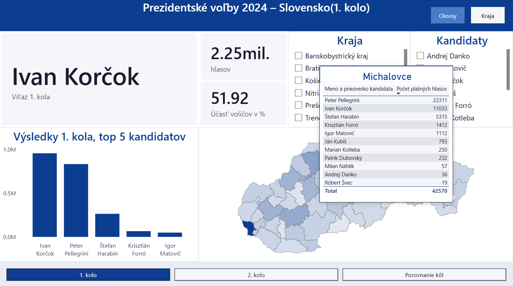
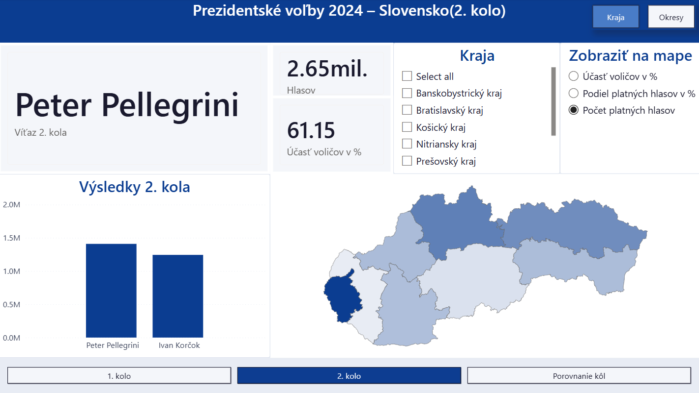
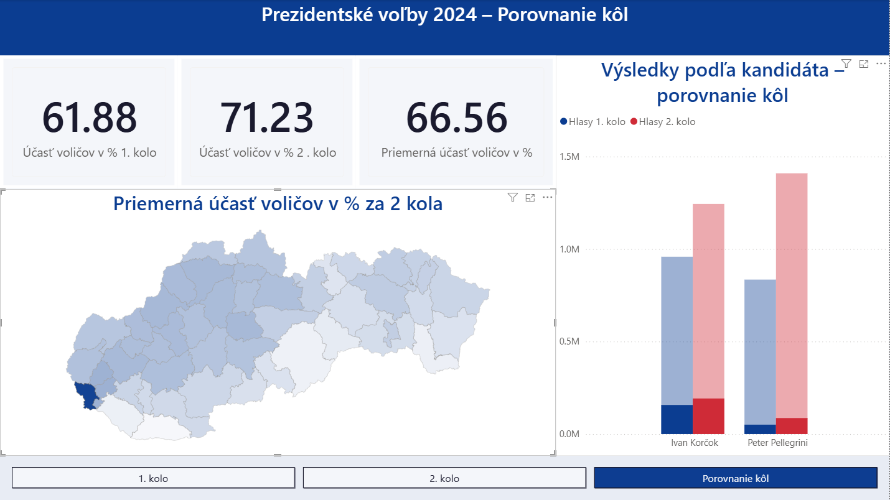
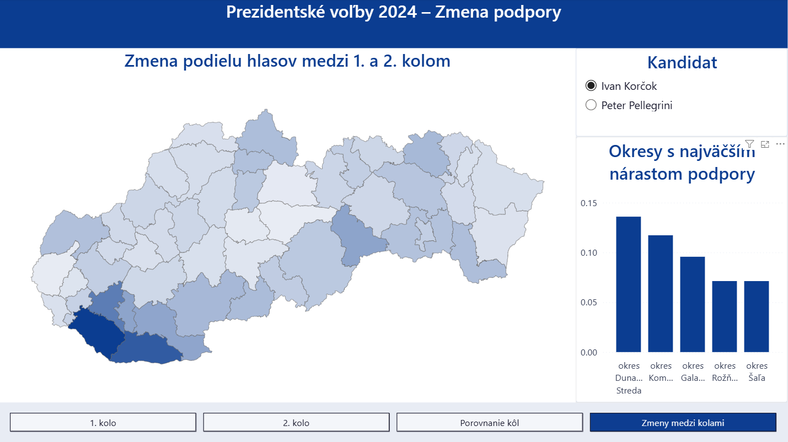

# Slovak Presidential Elections 2024 – Power BI Dashboard
Interactive Power BI dashboard analyzing the 2024 Slovak presidential election results across both rounds, built using official data from volby.statistics.sk.

## Dashboard Overview

The dashboard consists of 4 pages:
- **Round 1** – Results by district and region with candidate filter
- **Round 2** – Results with dynamic map modes (vote share, turnout, winner by district)
- **Comparison** – Side-by-side turnout and vote comparison across both rounds
- **Swing Analysis** - District-level change in vote share between rounds for each candidate

## Live Demo
[View Dashboard](https://app.powerbi.com/groups/me/reports/95ebee39-925d-4b3a-8eea-054bc5291d7c/9eb934369664c5908b9e?experience=power-bi)

**Round 1 – District view with custom tooltip**

**Round 2 – Vote count by region**

**Comparison page –  Bratislava selected**

**Swing Analysis**

## Features
- Interactive Shape Map with custom TopoJSON (49 districts, 8 regions)
- Dynamic map coloring via Field Parameters
- Custom tooltip pages for district and region maps
- Drill-through pages for both geographic levels
- Bookmark-based map type switcher

## Tools
- Power BI Desktop
- DAX
- Custom TopoJSON/GeoJSON
- Custom Power BI theme (Slovak flag colors)

## Key Insights
Pellegrini's surge came from the south
His top 5 districts by swing — Komárno (+37pp), Dunajská Streda (+32pp), Rimavská Sobota (+28pp), Veľký Krtíš (+24pp), Trebišov (+23pp) — are all located in southern Slovakia.
Korčok's base held firm but didn't grow
His highest swing districts — Dunajská Streda (+14pp), Komárno (+12pp), Galanta (+10pp) — overlap with Pellegrini's top districts, meaning both candidates gained there. But Korčok's gains were roughly half of Pellegrini's in the same areas, indicating he failed to consolidate the anti-Pellegrini vote.
Bratislava was Korčok's stronghold but not enough
Despite dominating Bratislava in Round 1, his swing there was only +3pp.

Turnout increased significantly from 51.92% to 61.15%, suggesting higher voter engagement in the decisive round.
The largest increase in turnout was observed in the northern districts, especially in Čadca, where the difference between rounds was more than 12%.
The south and eastern regions remained more passive for two rounds, with a slight increase after the first.
Komárno recorded the smallest turnout increase nationwide — just 6% between rounds.

## Data Source
Official Slovak election data: [volby.statistics.sk](https://volby.statistics.sk)
[Wikipedia](https://en.wikipedia.org/wiki/2024_Slovak_presidential_election), [Geopolitique.eu](https://geopolitique.eu/en/articles/presidential-election-in-slovakia-march-april-2024/)*
